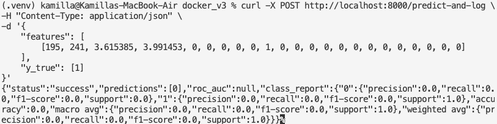

# Docker hw

Привет!

это небольшой [readMe.md](http://readme.md) о проделанной работе с `docker` и `mlflow`

Для того чтобы создать образ из Dockerfile я использовала команду

```docker
docker build -t random-forest-api . 
```

затем я создала контейнер на основе этого образа

```docker
docker run -d -p 8000:8000 --name random-forest-container random-forest-api
```

после чего в другом терминале запустила mlflow

```bash
mlflow server \
    --backend-store-uri sqlite:///mlflow.db \
    --default-artifact-root ./mlruns \
    --host 0.0.0.0 \
    --port 5001
```

и с помощью CURL команды проверила работает ли мой докер

```bash
curl -X POST http://localhost:8000/predict-and-log \
-H "Content-Type: application/json" \
-d '{
    "features": [
        [195, 241, 3.615385, 3.991453, 0, 0, 0, 0, 0, 1, 0, 0, 0, 0, 0, 0, 0, 0, 0, 0, 0, 0, 0]
    ],
    "y_true": [1]
}'
```

и, к счастью, он работал 🥳  (естественно не с первой попытки и даже не с первого дня как я начала работать с докером)



А MLflow доступен по ссылке [http://localhost:5001](http://localhost:5001/) 


Затем я чуть доработала скрипт чтобы всё сохранялось в Экспериментах 

